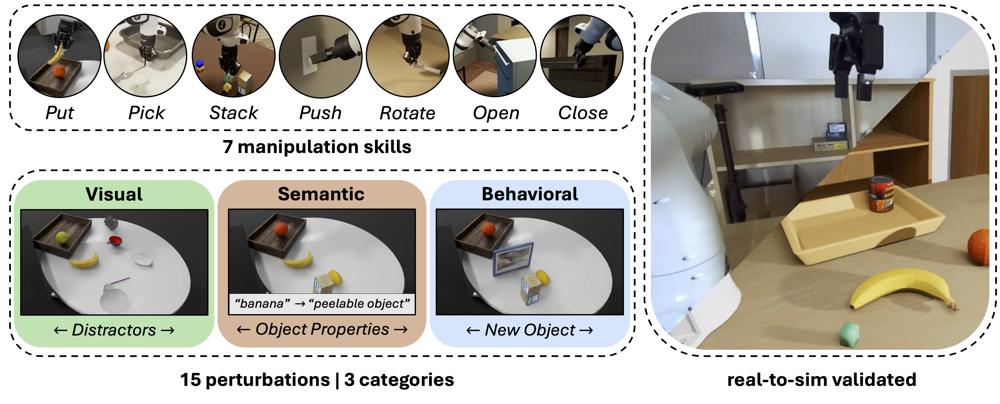

# REALM: A Real-to-Sim Validated Benchmark for Generalization in Robotic Manipulation

<p align="center">
  <a href="https://martin-sedlacek.com/realm"></a>
  <a href="https://arxiv.org/"></a>
  <a href="https://github.com/martin-sedlacek/REALM/wiki"></a>
  <a href="https://github.com/martin-sedlacek/REALM/issues"></a>
  <a href="https://github.com/martin-sedlacek/REALM/discussions"></a>
</p>



REALM is a large-scale realistic simulation environment and benchmark for generalization 
in robotic manipulation. It supports 7 distinct manipulation skills and stress-tests them 
against 15 perturbations. Through empirical validation, we show that evaluation results 
in simulation are strongly correlated to real-world performance. 

# Installation 🛠️
1. Clone the project repository:
```
git clone https://github.com/martin-sedlacek/REALM.git
cd REALM
```

2. Run the set-up script and download sim assets: 
```
# [RECOMMENDED OPTION] Docker installation (with downloading the dataset):
./setup.sh --docker --dataset

# Using a custom dataset path: 
./setup.sh --docker --dataset --data-path /path/to/dataset

# [UNSTABLE] Apptainer installation (with downloading the dataset):
./setup.sh --apptainer --dataset

# Using a custom apptainer .sif path: 
./setup.sh --apptainer --dataset --sif-path /path/to/realm.sif
```

> ❗ **Please note that running with apptainer is currently not stable.**
> We noticed that the apptainer can crash inexplicably on some systems. 
> It is recommended to use the stable Docker container if possible.


# Example Workflow: Pi0-FAST evaluation
> ⚠️ This example is provided for a single evaluation run on local hardware using an NVIDIA GPU with at least 16GB of VRAM. 
> This is required to run both the VLA model and underlying isaacsim on the same card.


1. Setup the model from openpi (https://github.com/Physical-Intelligence/openpi):
```
git clone https://github.com/Physical-Intelligence/openpi.git
cd openpi
uv sync
XLA_PYTHON_CLIENT_MEM_FRACTION=0.5 uv run scripts/serve_policy.py policy:checkpoint --policy.config=gs://openpi-assets/checkpoints/pi0_fast_droid_jointpos
```
> ❗ Set XLA_PYTHON_CLIENT_MEM_FRACTION such that you have at least 8GB+ free on the GPU for isaacsim.

> ⚠️ In general, make sure you are using models that output **absolute joint configurations** as REALM currently expects action to be in this format.

2. From the REALM project root, open the containerized environment:
```
# [RECOMMENDED OPTION] Docker:
source ./scripts/run_docker.sh

# [UNSTABLE] Apptainer:
source ./scripts/run_apptainer.sh
```

3. Inside the container run:
```
python /app/examples/01_pi0_eval.py
```

This should produce a rollout video and a numpy report file with the evaluation results inside the logs folder.

# End-to-end VLA benchmarking in REALM

⏰ Instructions on using REALM for proper benchmarking, using custom models, and how to systematically test on all tasks and 
preturbations will be provided soon.

Tabular results for the tested VLA models:

| Perturbation |        **$\pi_0$**        |     **$\pi_0$-FAST**      |      **GR00T N1.5**       |
| :--- |:-------------------------:|:-------------------------:|:-------------------------:|
| **Default** |           0.44            |           0.61            |           0.19            |
| **V-AUG** | 0.42 (-0.02 $\downarrow$) |  0.64 (+0.03 $\uparrow$)  |      0.19 (-0.00 -)       |
| **V-VIEW** |  0.52 (+0.08 $\uparrow$)  |  0.70 (+0.09 $\uparrow$)  |      0.19 (-0.00 -)       |
| **V-SC** | 0.43 (-0.01 $\downarrow$) | 0.60 (-0.02 $\downarrow$) |  0.21 (+0.02 $\uparrow$)  |
| **V-LIGHT** | 0.37 (-0.07 $\downarrow$) | 0.54 (-0.07 $\downarrow$) | 0.16 (-0.03 $\downarrow$) |
| **S-PROP** | 0.29 (-0.15 $\downarrow$) | 0.53 (-0.08 $\downarrow$) |  0.21 (+0.02 $\uparrow$)  |
| **S-LANG** | 0.36 (-0.08 $\downarrow$) | 0.61 (-0.01 $\downarrow$) |  0.21 (+0.02 $\uparrow$)  |
| **S-MO** | 0.35 (-0.09 $\downarrow$) | 0.55 (-0.06 $\downarrow$) |  0.20 (+0.01 $\uparrow$)  |
| **S-AFF** | 0.30 (-0.14 $\downarrow$) | 0.55 (-0.06 $\downarrow$) |  0.21 (+0.01 $\uparrow$)  |
| **S-INT** | 0.29 (-0.15 $\downarrow$) | 0.54 (-0.07 $\downarrow$) |  0.20 (+0.01 $\uparrow$)  |
| **B-HOBJ** | 0.32 (-0.12 $\downarrow$) | 0.38 (-0.23 $\downarrow$) | 0.16 (-0.03 $\downarrow$) |
| **SB-NOUN** | 0.28 (-0.16 $\downarrow$) | 0.39 (-0.22 $\downarrow$) | 0.17 (-0.02 $\downarrow$) |
| **SB-VRB** | 0.36 (-0.08 $\downarrow$) | 0.57 (-0.04 $\downarrow$) |  0.21 (+0.02 $\uparrow$)  |
| **VB-POSE** | 0.32 (-0.12 $\downarrow$) | 0.49 (-0.12 $\downarrow$) | 0.07 (-0.12 $\downarrow$) |
| **VB-MOBJ** | 0.38 (-0.06 $\downarrow$) | 0.53 (-0.09 $\downarrow$) | 0.09 (-0.10 $\downarrow$) |
| **VSB-NOBJ** | 0.16 (-0.28 $\downarrow$) | 0.26 (-0.35 $\downarrow$) | 0.09 (-0.10 $\downarrow$) |
| **V-Avg.** | 0.37 (-0.07 $\downarrow$) | 0.54 (-0.08 $\downarrow$) | 0.14 (-0.05 $\downarrow$) |
| **S-Avg.** | 0.30 (-0.14 $\downarrow$) | 0.50 (-0.11 $\downarrow$) |      0.19 (-0.00 -)       |
| **B-Avg.** | 0.30 (-0.13 $\downarrow$) | 0.44 (-0.17 $\downarrow$) | 0.13 (-0.06 $\downarrow$) |

Each number in the table is obtained by averaging the results over 10 tasks where each tasks is evaluated using a sample size of 25 rollouts at 800 time-steps with a fixed random seed of 1234.

# 🚧 Roadmap
- [x] Streamlined installation
- [x] Example scripts for getting started
- [ ] Improved benchmarking UX:
  - [ ] End-to-end scripts for producing result plots and tables
- [ ] Upload tabular results for all tasks / models / perturbations to ease reproducibility 
- [ ] Extended documentation
- [ ] Performance:
  - [ ] Support vectorized environments
  - [ ] Improve parallelism and overall execution speed


# Acknowledgments and Licensing
We build on top of essential simulation tooling and the dataset from BEHAVIOR-1K and adhere to their licensing and terms of usage. 
For more information, please see https://behavior.stanford.edu/.

This work was supported by the European Union's Horizon Europe projects AGIMUS (No. 101070165), euROBIN (No. 101070596), 
ERC FRONTIER (No. 101097822), and ELLIOT (No. 101214398). Pavlo Yefanov (PY) and Georgy Ponimatkin (GP) were also partly 
supported by Grant Agency of the Czech Technical University in Prague under allocations SGS25/158/OHK3/3T/13 (PY) and 
SGS25/156/OHK3/3T/13 (GP). Martin Sedlacek was partly supported by the ELLIS Unit Amsterdam as part of the MSc Honours Programme. 
Compute resources and infrastructure were supported by the Ministry of Education, Youth and Sports of the Czech Republic 
through the e- INFRA CZ (ID:90254) and by the European Union's Horizon Europe project CLARA (No. 101136607).

# Citation

If you use REALM or found our results useful for your research, please consider citing this work:
```
@article{sedlacek2025realm,
         title={REALM: A Real-to-Sim Validated Benchmark for Generalization in Robotic Manipulation},
         author={Martin Sedlacek and Pavlo Yefanov and Georgy Ponimatkin and Jai Bardhan and Simon Pilc and Mederic Fourmy and Evangelos Kazakos and Cees G. M. Snoek and Josef Sivic and Vladimir Petrik},
         journal = {arXiv preprint arXiv:2512.19562},
         year={2025}
}
```